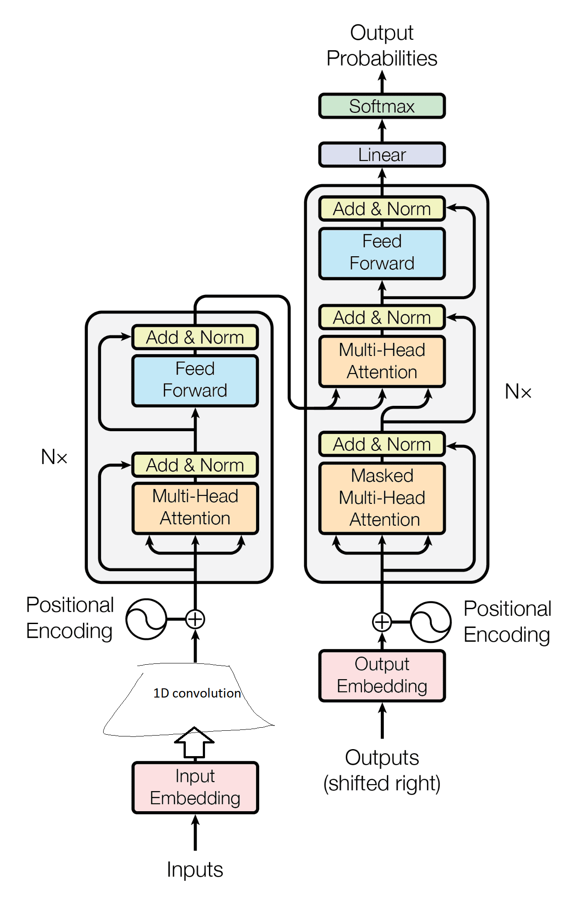

# Stuff

## Introduction

Implementing a Transformer model for sequence-to-sequence tasks.

The code leverages TensorFlow and Keras to construct a powerful architecture for natural language processing tasks.

## Code Overview

### Utility Functions

A set of utility functions is provided for fundamental tasks:

| function | doc |
| :--- | :--- |
| `get_angles` | Computes positional encoding angle rates. |
| `create_padding_mask` | Generates a padding mask to identify padded positions. |
| `create_look_ahead_mask` | Constructs a look-ahead mask to prevent attending to future positions. |
| `scaled_dot_product_attention` | Implements scaled dot-product attention. |
| `positional_encoding` | Generates positional encodings using sinusoidal functions. |
| `point_wise_feed_forward_network` | Defines a feed-forward neural network. |

### Multi-Head Attention

The `MultiHeadAttention` class implements multi-head attention with parallel attention heads, allowing the model to focus on different aspects of the input sequence simultaneously.

### Encoder and Decoder Layers

1. `EncoderLayer`: Incorporates multi-head attention and feed-forward sub-layers to capture sequential patterns.
2. `DecoderLayer`: Combines multi-head attention, feed-forward layers, and context from the encoder to generate target sequences.

### Encoder and Decoder

1. `Encoder`: Comprises multiple EncoderLayer instances to process input sequences and capture local patterns using a Convolutional Neural Network (CNN) layer.
2. `Decoder`: Comprises multiple DecoderLayer instances to generate output sequences while attending to encoder outputs.

### Transformer Model

The `Transformer` class integrates the encoder and decoder, and a final dense layer generates the output sequences.

## Core Concepts

### Positional Encoding

The model leverages positional encoding to convey position information to the Transformer.

The `positional_encoding` function generates encoding vectors using sine and cosine functions.

### About Multi-Head Attention

The foundation of the Transformer architecture, multi-head attention allows the model to focus on different parts of the sequence simultaneously.

### Feed-Forward Neural Networks

Position-wise feed-forward networks contribute to the model's non-linear capacity by applying two fully connected layers.

## Hyperparameters

The code includes a set of hyperparameters that control the model's behavior:

| parameter | wdid | default |
| :--- | :--- | ---: |
| `NUM_LAYERS` | Number of layers in the encoder and decoder. | 6 |
| `D_MODEL` | Dimensionality of embeddings and hidden layers. | 512 |
| `NUM_HEADS` | Number of attention heads in multi-head attention mechanisms. | 8 |
| `DFF` | Dimensionality of feed-forward neural networks. | 2048 |
| `INPUT_VOCAB_SIZE` | Vocabulary size for input sequences. | 10000 |
| `TARGET_VOCAB_SIZE` | Vocabulary size for target sequences. | 8000 |
| `DROPOUT_RATE` | Dropout rate applied to various layers. | 0.1 |
| `MAXIMUM_POSITION_ENCODING` | Maximum length of positional encodings. | 10000 |
| `TARGET_SEQ_LENGTH` | Maximum length of the target sequence. | 50 |

## Usage

To utilize the code:

1. Ensure required libraries, particularly TensorFlow, are installed.
2. Replace `"your_data.csv"` with the actual CSV filename and adjust column names.
3. Execute the script to load data, apply masks, create the model, and generate output.
